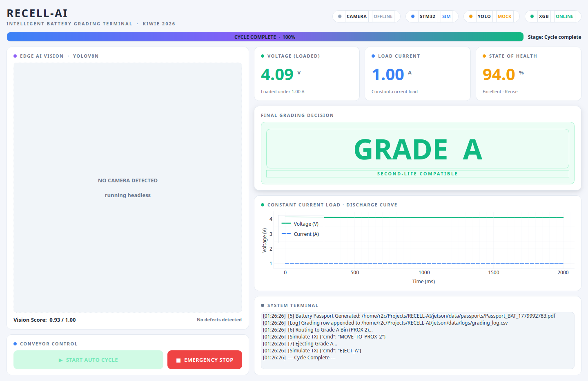
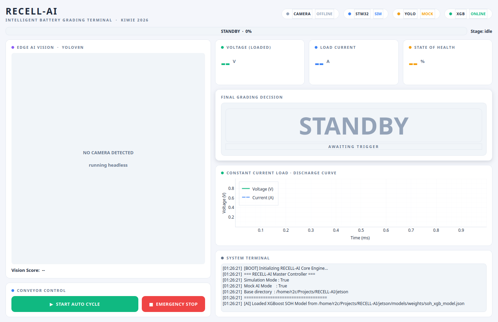
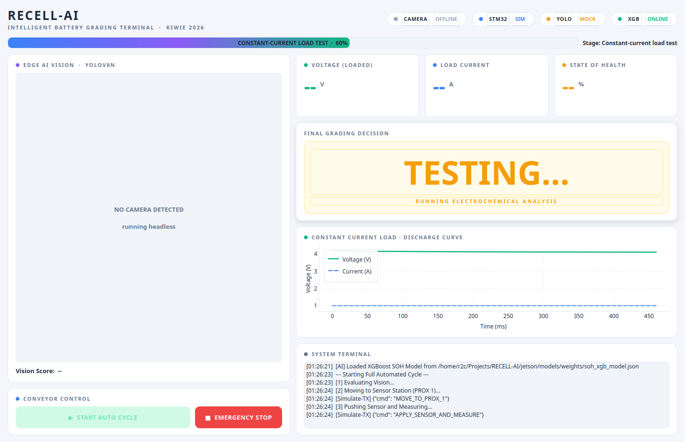

# 🔋 RECELL-AI

> **Mesin Klasifikasi Otomatis Baterai Bekas (*Second-Life*) Standar Industri**
> Sistem grading multimodal (Computer Vision + Time-Series Electrochemistry) untuk kompetisi **KIWIE 2026**.


---

## 🖥️ Tampilan Dashboard



<details>
<summary>Lihat state lain (STANDBY & TESTING)</summary>

| STANDBY (sebelum cycle) | TESTING (saat constant-current load) |
| :---: | :---: |
|  |  |
</details>

---

## 📂 Struktur Workspace

| Modul | Deskripsi | Status |
| :--- | :--- | :--- |
| [**🧠 `jetson/`**](./jetson) | Otak AI multimodal (YOLOv8n + XGBoost), dashboard PyQt5, orkestrasi cycle | `Software siap` |
| [**🦾 `firmware/`**](./firmware) | Firmware STM32F411: ADC 12-bit, kontrol stepper & konveyor, payload JSON | `Siap di-flash` |
| [**🔬 `research/`**](./research) | Whitepaper, arsitektur AI, plot matplotlib untuk publikasi | `Aktif` |
| [**📖 `docs/`**](./docs) | Panduan deploy, cheatsheet rumus SoH, gambar dashboard | `Aktif` |

---

## 🧠 Arsitektur Multimodal

```
┌──────────────────┐     ┌──────────────────┐     ┌──────────────────┐
│  YOLOv8n  (Vision)│     │  XGBoost  (SOH)  │     │  STM32  (Sensor) │
│  best.pt          │     │  soh_xgb.json    │     │  INA226+MLX90614 │
│  KARAT/SEHAT/SOBEK│     │  v_drop, Rint, ΔT│     │  JSON @115200 8N1│
└────────┬─────────┘     └────────┬─────────┘     └────────┬─────────┘
         │                        │                        │
         ▼                        ▼                        ▼
        Vision Score         SoH Prediksi (%)        Telemetri Real-time
                  \           |           /
                   \          |          /
                    ▼         ▼         ▼
            ┌────────────────────────────────┐
            │   Grading Decision (A / B / R) │
            │   • Vision < 0.4 OR SOH < 60 → R│
            │   • Vision > 0.8 AND SOH > 80 → A│
            │   • selainnya → B               │
            └────────────────┬───────────────┘
                             ▼
            ┌────────────────────────────────┐
            │   Battery Passport (PDF) +     │
            │   grading_log.csv + discharge  │
            └────────────────────────────────┘
```

---

## 🚀 Quick Start

### 1. Install dependency
```bash
# Recommended (di Jetson Orin Nano): ikuti panduan resmi NVIDIA untuk torch + opencv
# Di PC dev (CPU-only):
pip install -r jetson/requirements.txt
pip install torch torchvision --index-url https://download.pytorch.org/whl/cpu
```

### 2. Pastikan model siap
```text
jetson/models/weights/
├── best.pt              # YOLOv8n (KARAT / SEHAT / SOBEK)
└── soh_xgb_model.json   # XGBoost SoH regressor (NASA-trained)
```

### 3. Jalankan dashboard
```bash
cd jetson/src

# Mode 1 — Sim + YOLO real + kamera laptop
python3 ui_dashboard.py --sim

# Mode 2 — Sim + tanpa YOLO/kamera (paling cepat, GUI saja)
python3 ui_dashboard.py --sim --mock-ai

# Mode 3 — Produksi (STM32 di /dev/ttyUSB0)
python3 ui_dashboard.py
```

### 4. (Jetson saja) Kompilasi YOLO ke TensorRT
```bash
# Di Jetson Orin Nano — 2× lebih cepat dengan FP16
yolo export model=jetson/models/weights/best.pt format=engine half=True workspace=4
# main.py akan otomatis prefer best.engine di atas best.pt
```

---

## 🔬 AI Vision Classes

Model `best.pt` dilatih untuk 3 kelas:

| Label | Arti | Efek pada Vision Score | Catatan |
| :---: | :--- | :--- | :--- |
| **`KARAT`** | Korosi/karat di kutub | `-0.4` | False positive di-filter oleh threshold persistence (≥ 3 frame) |
| **`SOBEK`** | Wrapper plastik sobek | **`critical → 0`** | Otomatis Grade R, isolasi listrik hilang |
| **`SEHAT`** | Baterai bersih | `0` (informational) | Tidak menambah/mengurangi skor |

> **Penting** — Vision Score = `1.00` bukan berarti AI bekerja sempurna; bisa juga berarti **tidak ada deteksi sama sekali** (kamera kosong / objek bukan baterai). Cek bounding box muncul di feed untuk konfirmasi.

---

## ⚡ AI Electrical (SoH)

XGBoost regressor dilatih pada **NASA Prognostics Battery Dataset**. Fitur input:

| Fitur | Sumber | Rentang Khas |
| :--- | :--- | :--- |
| `v_drop` (V) | `v_resting − v_loaded` | 0.05 – 0.50 |
| `internal_r` (Ω) | `v_drop / current_load` | 0.05 – 0.50 |
| `temp_delta` (°C) | `temp_post − temp_pre` | 0.5 – 8.0 |

Output: prediksi SoH (%) dengan clamp `[0, 100]`. Fallback rule-based aktif jika model gagal di-load.

---

## 🔌 Pinout Hardware (STM32F411CEU6)

### Aktuator & Konveyor (Motor Driver BTS7960)
| Pin | Fungsi | Deskripsi |
| :---: | :--- | :--- |
| `PA5` | `CONVEYOR_EN` | Enable BTS7960 |
| `PA1` | `CONVEYOR_RPWM` | PWM maju |
| `PA2` | `CONVEYOR_LPWM` | PWM mundur |
| `PB0` / `PB9` / `PA7` | `STP_DRAIN_*` | Stepper Drain Station (DIR/PUL/EN) |
| `PA3` / `PA8` / `PA6` | `STP_SORT_*` | Stepper Sorting Station (DIR/PUL/EN) |

### Sensor, Limit Switch & Pengukuran
| Pin | Fungsi | Deskripsi |
| :---: | :--- | :--- |
| `PB15` / `PA4` | `LIMIT_DRAIN` / `LIMIT_SORTING` | Batas mekanik stepper |
| `PB14` / `PB12` / `PB13` | `IR_DRAIN` / `IR_SORTING` / `IR_BACKUP` | Sensor IR baterai |
| `PB5` | `EMERGENCY` | Tombol Emergency Stop |
| `PB1` | `DAC_EN` | Enable Constant-Current Load (DAC MCP4725) |
| `PB7` / `PB6` | `I2C SDA` / `SCL` | Bus untuk INA226 (V/I), MLX90614 (suhu), MCP4725 (DAC) |

---

## 🔄 Cycle Otomatis (7 Langkah)

```
[1] Evaluasi Vision (capture frame, klasifikasi YOLO)
[2] Konveyor → PROX 1 (Sensor Station)
[3] Push sensor + Constant-Current Load Test (~2s discharge curve)
[4] Hitung Grade (A / B / R) dari vision_score + SoH
[5] Generate Battery Passport (PDF)
[6] Routing:
    - Grade A → PROX 2 → Eject ke bin A
    - Grade B/R → END_OF_CONVEYOR → bin reject
[7] Cycle Complete + log CSV (grading_log + discharge_curve)
```

Emergency Stop dapat memutus cycle di langkah manapun (set `abort_cycle` flag, putus semua wait loop).

---

## 📊 Output Per Cycle

| File | Path | Isi |
| :--- | :--- | :--- |
| Battery Passport | `jetson/data/passports/Passport_<ID>.pdf` | Sertifikat per-baterai: ID, grade, foto, V/I/SoH |
| Grading log | `jetson/data/logs/grading_log.csv` | 1 baris per cycle: semua metrik agregat + ground truth |
| Discharge curve | `jetson/data/logs/discharge_curve.csv` | Time-series 20 ms cadence: t_ms, voltage, current, temp |

`battery_id` shared antar 3 file, jadi kurva discharge bisa di-join balik ke grade-nya untuk analisa offline.

---

## 🛠️ Stack Teknologi

### 🖥️ Jetson Orin Nano
- **Python 3.10+**, **PyQt5** + **pyqtgraph** (HMI light theme yang dipoles)
- **YOLOv8n** (Ultralytics) → ekspor TensorRT FP16 untuk produksi
- **XGBoost** Regressor 2.x
- **FPDF** untuk Battery Passport, **SQLAlchemy/CSV** untuk log

### 🦾 STM32 BlackPill (F411CEU6)
- **Arduino IDE + STM32duino Core**
- ADC 12-bit native + **oversampling N=50** (noise reduction)
- USB-CDC Serial @ **115200 8N1**, payload JSON

---

## 🧪 Status Verifikasi

| Komponen | Bisa diuji tanpa hardware? | Status |
| :--- | :---: | :--- |
| Dashboard GUI (semua state) | ✅ | Terverifikasi via smoke-test 3-stage |
| YOLO load + inferensi webcam | ✅ | Terverifikasi (3 kelas, KARAT/SEHAT/SOBEK) |
| XGBoost SoH prediksi | ⚠️ | Load OK, akurasi perlu validasi pada baterai nyata |
| Battery Passport PDF | ✅ | PDF tergenerasi end-to-end |
| CSV grading + discharge log | ✅ | Schema lengkap, sample tersimpan benar |
| Emergency Stop full abort | ⚠️ | Logic ada, validasi di lab dengan STM32 |
| Komunikasi serial STM32 | ❌ | Butuh hardware |
| Konveyor + stepper motor | ❌ | Butuh hardware |
| Persistence threshold defects | ⚠️ | Logic ada, validasi dengan kamera + baterai nyata |

---

## 📚 Dokumentasi Tambahan

- 📖 [**DEPLOY_GUIDE_RECELL**](./docs/DEPLOY_GUIDE_RECELL.md) — Setup Jetson, flash STM32, SSH
- 📐 [**Cheatsheet Rumus SOH**](./docs/Cheatsheet_Rumus_SOH.md) — Penjabaran algoritma elektrokimia
- 🤖 [**AI Training Guideline**](./jetson/AI_TRAINING_GUIDELINE.md) — Pipeline training YOLO + XGBoost
- 🗂️ [**KONTEKS.md**](./KONTEKS.md) — Master AI handover document

---

## 👨‍💻 Tim

**Amadeo Wisesa** — *System Architect & AI Engineer*

> Dikembangkan untuk RECELL-AI · KIWIE 2026 Edition · Indonesia 🇮🇩
